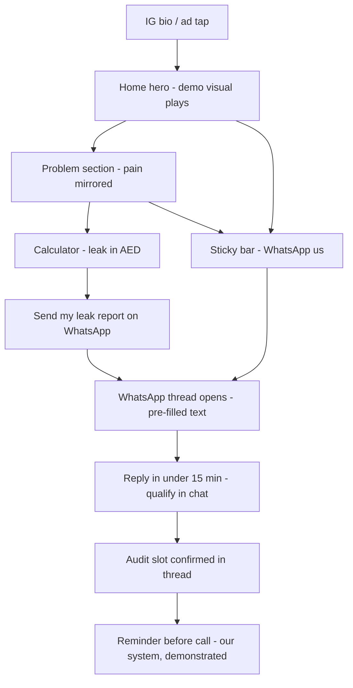
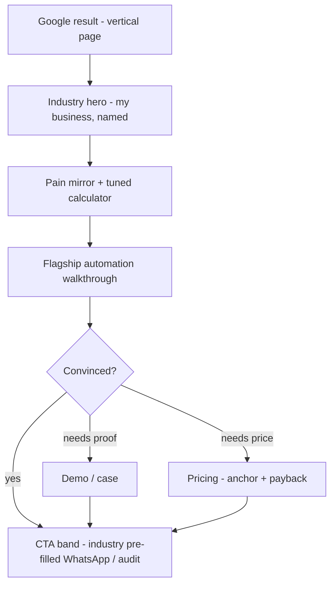

# YanForge — Information Architecture & UX Architecture

**IA v1.0 · Companion to `strategy-and-website-spec.md` v1.1** — deepens §10–§13 of the strategy spec; where this document is more specific, it governs. **No UI here** — only structure, wayfinding, flows, funnels and conversion architecture.

Role: Senior UX Architect.

---

## 0. Architecture principles

The Apple + Stripe + Clay instruction, translated into *IA rules* (not visual ones):

| Lineage | IA translation | Enforced as |
|---|---|---|
| **Apple** — subtraction | Navigation of five. No dropdowns, no mega-menus, no dead ends. Every page earns its slot or gets folded. | Nav spec §3, kill-criteria column §1.3 |
| **Stripe** — the product is the argument | The demo is reachable within one interaction from any page. Every template orders content: **outcome → demonstration → mechanism → proof → ask.** | Template rules §5, linking rules §9 |
| **Clay** — structure with a pulse | The founder is a *navigation destination*, not a paragraph. Candor blocks ("what this is not") are reusable IA components. The "low-stakes" pages — confirmation, 404 — carry warmth, because that's where personality is believed. | §5.7, §5.8, §5.11 |

Four house rules on top:

1. **One click to conversion from everywhere.** The nav CTA and persistent chrome guarantee the audit is never more than one interaction away.
2. **Two clicks to anything.** Maximum depth from Home to any content page = 2. No page is an orphan.
3. **Every page ends with a fork:** the P0 ask (audit) + one softer "not ready yet" path (P1). Skeptics need an escape route that keeps them in the system — a trapped feeling reads as a sales trap.
4. **Structure mirrors the owner's questions, in order:** *What is this? Is it for me? Does it work? Who are you? What does it cost? What happens if I say yes?* — the six questions are the six primary destinations.

---

## 1. Site model & page inventory

### 1.1 Sitemap (canonical tree)

```
/                               Home — the whole argument in miniature
/system                         The System — what the machine is & how it connects
/industries                     Industries hub — self-segmentation moment
  /industries/med-spas          ┐
  /industries/salons            │
  /industries/dental            ├─ the five verticals (templated, per-vertical deltas §5.3)
  /industries/gyms              │
  /industries/premium-services  ┘
/process                        How working with us actually goes (de-risking)
/pricing                        Investment, anchors, ROI logic (self-qualification)
/results                        Case-study index               [GATED — §11]
  /results/[case-slug]          Case detail                    [GATED — §11]
/about                          Founder, story, local legitimacy
/demo                           "See it run" — standalone proof unit [Phase 1.5]
/growth-audit                   Conversion hub (dual rail: WhatsApp / calendar)
  /growth-audit/booked          Confirmation — the flow that proves the product
/insights                       Playbooks hub                  [Phase 2]
  /insights/[slug]              Article / playbook             [Phase 2]
/legal/privacy · /legal/terms   Legitimacy & consent
/404                            Recovery page (a designed page, not a default)
/ar/*                           Arabic mirror of the full tree [Phase 2, RTL]
```

**IA revision (supersedes strategy spec §10):** the conversion hub is **`/growth-audit`**, not `/contact`. The URL *is* the offer — it reads right in an ad, a QR code, and a WhatsApp message ("yanforge.com/growth-audit"). `/contact` 301-redirects to it. A generic "contact" page invites generic messages; a named offer page invites the one action the site exists for.

### 1.2 Depth & reach rules

- Depth 0: Home. Depth 1: all six primary destinations + growth-audit. Depth 2: industry pages, case details, articles, booked.
- Breadcrumbs render only at depth 2 (Industries › Med Spas; Results › [case]) with structured data. Depth 1 pages need no breadcrumb — the nav is the breadcrumb.
- Page title pattern: `[Page] — YanForge` · industry pages: `Growth Systems for [Industry] in the UAE — YanForge` (search intent in the title, owner vocabulary).

### 1.3 Why every page exists (and when it dies)

| Page | The owner's question it answers | Why it must be a *page* (not a section) | Kill criteria |
|---|---|---|---|
| Home | "What is this and is it worth my next 90 seconds?" | The whole argument in miniature; every campaign's default landing. | Never. |
| /system | "How does it actually work? What happens to my current tools?" | Depth the homepage can't carry without bloating; doubles as the **pre-audit read** we send in WhatsApp before calls. | If analytics show <5% of audit-bookers ever visit, fold into Home and revisit. |
| /industries (hub) | "Which of these is me?" | The self-segmentation *moment* — one meaningful tap that makes everything after feel tailored. Also the SEO hub that concentrates internal links to the five money pages. | If ≥80% of traffic enters verticals directly (search/ads), demote to a routing block on Home. |
| /industries/[×5] | "Does this work for a business *like mine*?" | The highest-relevance, highest-ranking pages on the site. Objections, vocabulary, calculator defaults and flagship automations differ per vertical — a generic page converts none of them. | A vertical page with no traffic and no bookings after 2 quarters merges back into the hub. |
| /process | "What happens *to me* if I say yes? Will this disrupt my salon for a month?" | Distinct anxiety from /system: system = what the machine is; process = what the *engagement* feels like. Mixing them buries the de-risking. | If FAQ + process snapshot on industry pages measurably kill the objection first, fold into /system. |
| /pricing | "Can I afford it — and are they honest?" | The *existence* of a transparent pricing page is itself a trust signal for agency-burned buyers. Also the self-qualification ritual: owners check price before they'll spend a call. | Never while we sell to skeptics. |
| /results | "Prove it." | The compounding trust asset; each real case is a landing page for its vertical. | **Reverse-gated:** doesn't exist until 2 real, permissioned cases (§11). |
| /about | "Who is behind this? Are they real, and are they *here*?" | The verifier persona navigates here *before* believing anything else. Faces, story, UAE grounding need a dedicated stop. | Never. |
| /demo | "Show me — without talking to anyone." | A shareable, ad-landable proof unit; the link we drop into WhatsApp threads. Zero-commitment belief-building. | Ships Phase 1.5 with the live demo line; until then `#demo` on Home carries the job. |
| /growth-audit | "OK — what's the first step?" | One conversion hub, minimal cognitive load, ad-landable. Forms + calendar + reassurance live here and nowhere else. | Never. |
| /growth-audit/booked | "Did that work? What now?" | Sets expectations, starts the WhatsApp thread, reduces no-show on *our own* audit call — the booking flow must demonstrate the very system we sell (§5.8). | Never. |
| /insights (Ph2) | "Are these people actually experts?" | Authority + non-brand SEO capture. | Launches only with ≥5 genuinely useful playbooks; a thin blog is anti-trust. |
| /legal/* | "Are they a real business handling data properly?" | Consent microcopy on every form links here; TDRA/PDPL legitimacy. | Never. |
| /404 | "Am I lost?" | Rule 3: no dead ends — recovery routes + WhatsApp. | Never. |

---

## 2. URL, taxonomy & wayfinding conventions

- Lowercase-hyphenated slugs, no dates, no stop-words: `/industries/med-spas`, `/results/jumeirah-salon-no-shows`.
- Industry slugs are **frozen identifiers** — they appear in ads, pre-filled WhatsApp texts and analytics; renaming breaks attribution.
- Canonical: `/contact` → 301 → `/growth-audit`. Trailing-slash normalized. One `sitemap.xml`; `/growth-audit/booked`, `/404` and gated pages `noindex`.
- Anchor registry (stable IDs, deep-linkable from ads and WhatsApp): `#demo` · `#calculator` · `#system-map` · `#journey` · `#tiers` · `#faq` · `#founding-partners`.
- Active-page indication in nav; scroll-position restoration on back-navigation (skeptics compare pages back-and-forth — losing their place punishes research behavior).

---

## 3. Navigation architecture (desktop)

**Top bar — exactly five links + one CTA + one channel affordance:**

```
[YanForge]     The System   Industries   Pricing   About   See it run      [Get my free Growth Audit]  [WA]
```

- **No dropdowns anywhere.** Apple rule: five links don't need a menu system. "Industries" goes to the hub — the extra tap *is* the self-segmentation moment, not a detour. (Stripe uses dropdowns because they have 50 products; we have six questions.)
- **`See it run`** anchors to `#demo` (Home) at launch; re-points to `/demo` when the live line ships; **is replaced by `Results`** when the case gate opens (§11). One slot, three eras — the nav itself matures with our proof.
- **Process is deliberately absent from the nav.** It's a mid-funnel reassurance encountered at the moment of doubt (linked from every de-risking context: pricing, industry pages, growth-audit, FAQ answers), not a destination owners seek by name. Nav minimalism buys more than a sixth link would.
- Behavior: sticky; condenses on scroll; skip-to-content link first in tab order; `aria-current` on active page.
- The nav CTA is the **only** P0 button visible in the header — never two competing primaries in one strip (WhatsApp icon is channel chrome, not a second CTA).

---

## 4. Mobile navigation & persistent conversion chrome

**Top bar (mobile):** `[YanForge] ————— [WA icon] [Menu]` — "Menu" is labeled, not icon-only (40+ audience; discoverability beats minimal-chic).

**Menu sheet (full-height, in this order):**
1. The System
2. Industries — expands *in-sheet* to the five verticals (accordion, single level)
3. Pricing
4. About
5. See it run / Results (same slot-swap rule as desktop)
6. — divider —
7. **[Get my free Growth Audit]** — P0, pinned at sheet bottom in thumb zone
8. `We reply within 15 minutes, 9am–9pm GST` — response-promise chip under the CTA
9. WhatsApp row (`Message us on WhatsApp`) · language toggle (Phase 2) 

**Sticky bottom CTA bar** (the workhorse of mobile conversion):
- Two actions: **[WhatsApp us]** (P0, molten) + **[Book audit]** (P1) — the dual rail, WhatsApp-primary per strategy v1.1.
- Appears after scroll intent (past 120% of first viewport) — never instantly over content; hides while any input is focused; respects iOS safe-area.
- **Suppressed on `/growth-audit` and `/booked`** — the page *is* the conversion; double chrome reads as pressure.
- **The WhatsApp float is desktop-only.** On mobile the sticky bar already carries WhatsApp — duplicated affordances erode trust and eat viewport.

---

## 5. Page-by-page architecture

Format per page: **Why it exists → who lands here → section map (in argument order) → exits.** Homepage section detail lives in strategy spec §11; listed here as skeleton for the link graph.

### 5.1 Home `/`
*Why:* the whole argument in miniature. *Lands here:* IG bio/ads (mobile, in-app browser), brand search, referrals.

| # | Section | Job | Anchor |
|---|---|---|---|
| 1 | Hero + live WhatsApp demo visual | Promise + category + first proof | — |
| 2 | Problem + embedded leak calculator | Mirror pain, quantify it in AED | `#calculator` |
| 3 | The System (dark band: shift → modules → journey) | Believe the mechanism | `#system-map` |
| 4 | Proof (demo / founding partners → real metrics later) | Trust payload | `#demo` |
| 5 | Industries (five tiles) | "It's for me" routing | — |
| 6 | Why different + process stepper | De-risk + differentiate | — |
| 7 | Pricing anchor | Self-qualify | — |
| 8 | About snapshot | A face before the ask | — |
| 9 | FAQ | Last objections | `#faq` |
| 10 | Final CTA band | The ask | — |

*Exits:* every section forwards one level deeper (2→calculator report via WhatsApp; 3→/system; 4→/demo; 5→industry pages; 6→/process; 7→/pricing; 8→/about); nav CTA + sticky bar always → /growth-audit.

### 5.2 The System `/system`
*Why:* depth for the "how does it actually work" verifier; the **pre-audit read** we send before calls. *Lands here:* Home §3, nav, WhatsApp links.

1. Hero — claim + system diagram, CTA pair
2. The principle — why one connected system beats ten tools (mechanism proof, plain language)
3. Module walkthroughs ×7 — each: what it does → the outcome → real UI → *"connects with what you already have"* note
4. The client journey, expanded — Lead → Booked → Showed → Returned → Tracked (`#journey`)
5. Integration reality — the tools we connect vs. replace (Fresha/Zenoti, Google Calendar, Instagram, Tabby/Telr/Stripe) — kills the "throw everything away" fear
6. Data & control — what the owner sees and owns (dashboard, plain numbers)
7. System FAQ — migration, downtime, tool replacement, who maintains it
8. CTA band — audit (P0) + *"see how an engagement runs"* → /process (P1)

### 5.3 Industries hub `/industries` + the five verticals
*Hub why:* the "which are you?" moment + SEO link concentrator. *Hub sections:* 1. Framing hero · 2. Five vertical cards (pain-first one-liners) · 3. Shared-outcomes strip (what every service business gets) · 4. *"Don't see your business?"* → WhatsApp qualifier · 5. CTA band.

**Vertical template (all five follow it):**
1. Hero — industry-named promise + industry trust chips
2. Pain mirror — four leaks in *that* industry's vocabulary
3. Leak calculator — **pre-tuned defaults per vertical** (see deltas)
4. The system for [industry] — modules re-narrated + one flagship automation walked step-by-step
5. Proof — industry case when real; until then demo + founding-partner variant
6. "What changes in week one" — 3-step process snapshot → /process
7. Industry FAQ (5–6, objection-specific)
8. CTA band — WhatsApp pre-fill names the industry (attribution + relevance)

**Per-vertical deltas (what actually changes — the reason five pages exist):**

| Vertical | Hero promise centers on | Top pain named | Calculator defaults | Flagship automation scenario | Killer objection handled |
|---|---|---|---|---|---|
| Med spas | Consultations booked & followed up | Lead cost wasted by slow follow-up | High ticket (~AED 1,500+), low volume | 9pm enquiry → qualified → consult booked before morning | "Is automated follow-up compliant/discreet?" |
| Salons | Full chairs, fewer no-shows | No-shows + WhatsApp chaos at reception | Mid ticket, high volume | No-show → slot auto-offered to waitlist | "My clients only book by DM — will they adapt?" |
| Dental | Recall & reactivation | Empty chair gaps, lapsed 6-month recalls | Insurance-mix ticket, steady volume | Lapsed-patient reactivation cadence on WhatsApp | "What about insurance workflows?" |
| Gyms | Membership growth & churn cut | Drop-off after month 2, no win-back | Subscription ticket, churn variable | Missed-visits streak → win-back offer sequence | "We already use a gym app — replace or connect?" |
| Premium services | An operation as premium as the brand | Brand-damaging chaos behind a premium front | High ticket, discretion-weighted | VIP client journey with concierge-grade follow-up | "Will automation feel cheap to my clients?" |

### 5.4 Results `/results` + `/results/[case]` — **gated (§11)**
*Why:* compounding proof; each case is a vertical landing page.
*Index:* 1. Claim hero · 2. Industry filter · 3. Case cards · 4. **"How we measure"** method note (verified numbers, no fluff — the anti-fabrication rule made visible) · 5. CTA band.
*Case detail template:* 1. Snapshot header (business type, area, headline number) · 2. The problem · 3. What we forged (modules involved) · 4. The numbers (before/after) · 5. Owner quote (fully attributed) · 6. *"What this means for your [industry]"* → vertical page · 7. CTA band.

### 5.5 Process `/process`
*Why:* kills "too complicated / it'll disrupt my operations" — a different anxiety than /system answers.
1. Hero — *A clear path from chaos to system*
2. The five steps, expanded — each: duration · what we do · what you do · what you get
3. Week-one reality — parallel run, staff onboarding, zero-downtime promise
4. Ongoing operation — who does what after launch (*we run, you see*)
5. What the audit itself looks like — bridge to conversion (30 min, what we ask, what you get)
6. Process FAQ — time commitment, staff resistance, contract shape
7. CTA band — audit (P0) + pricing (P1)

### 5.6 Pricing `/pricing`
*Why:* self-qualification ritual + honesty signal (see strategy §12.5 — "from AED" anchors are policy).
1. Hero — honesty framing
2. Tier cards ×3 + custom — anchors, what's inside, *"best for"* (`#tiers`)
3. ROI logic — the calculator, reframed as payback (*"recovers its cost at N rebookings/month"*)
4. Always included — operation, reporting, response promise
5. Honest comparison — vs. hiring, vs. DIY SaaS, vs. traditional agency (their strengths admitted; candor block)
6. Engagement terms & risk reversal — phased, audit-first, blueprint is yours regardless
7. Pricing FAQ — contracts, setup vs. monthly, VAT
8. CTA band — audit (P0) + *"see exactly what happens after yes"* → /process (P1)

### 5.7 About `/about`
*Why:* the verifier's first stop; "who's behind this" cannot be a paragraph.
1. Hero — founder, face, thesis (*built by people who understand UAE service businesses*)
2. The story — the observation that created YanForge (owners burned by output-sellers)
3. How we work — values as behaviors, not adjectives (engineer-operated · measured in revenue · candid)
4. Founding-partner program — the pre-proof-era candor block (`#founding-partners`)
5. Local grounding — UAE presence, +971, address, response promise
6. CTA band — **warm variant:** WhatsApp-first (*talk to a person*), audit second

### 5.8 Growth Audit `/growth-audit` + `/growth-audit/booked`
*Why:* one conversion hub; everything else on the site points here.

`/growth-audit`:
1. Header — the blueprint promise + response promise. **Full nav stays** (a trapped page reads as a sales trap to skeptics); sticky bar + float suppressed (the page is the CTA).
2. **Dual-rail chooser** — WhatsApp (primary on mobile) | pick a slot (calendar, co-primary desktop)
3. Micro-form (name · business type · area · WhatsApp number) → calendar embed
4. What happens next — 3 steps: reply in ≤15 min → 30-min audit → blueprint within 48h
5. Candor block — what the audit **is not** (not a pitch; you keep the blueprint either way)
6. Proof strip — testimonial when real; founding-partner note until then
7. Mini-FAQ ×3 — how long, what to prepare, what it costs (nothing)

`/growth-audit/booked`:
1. Confirmation + next-steps timeline
2. **Start the thread** — save-our-contact (vCard) + one-tap WhatsApp opener
3. Prepare — three things to have handy (calendar access, a rough monthly-numbers sense, current tool list)
4. While you wait — the demo / a case / the System page
- **Architectural point:** this flow *is* a product demonstration. We sell no-show reduction — so our own booking confirms instantly on WhatsApp and reminds before the call. The visitor experiences the machine working on *them* before they've paid a dirham. Instrumented as the conversion pixel page.

### 5.9 Demo `/demo` *(Phase 1.5)*
*Why:* a shareable proof unit — the link that gets dropped into WhatsApp conversations and runs as an ad landing.
1. The interactive thread player, near-full-viewport
2. The live line — *"Text DEMO to +971 …"* instructions
3. What just happened — annotated beats (enquiry → reply → slot → booked → reminder → review)
4. CTA band — *"now watch it run on your business"* → audit

### 5.10 Insights `/insights` *(Phase 2)*
Hub (filter by vertical + topic) + article template (playbook body → related vertical page → contextual audit CTA). Exists for authority + non-brand search; gated behind ≥5 genuinely useful pieces.

### 5.11 System pages
- **404:** *"This page doesn't exist. Your growth system should."* → routes: Home · Industries · WhatsApp. Warmth where it's believed; no dead ends.
- **Legal:** privacy (PDPL/TDRA-aware, WhatsApp consent language) + terms. Linked from every form's consent microcopy and footer.

### 5.12 Arabic mirror `/ar/*` *(Phase 2)*
Full-tree mirror, human-translated, RTL. Parity rules: same IA, same gates, same CTA hierarchy; language toggle preserves the current page (`/pricing` ↔ `/ar/pricing`), never bounces to home.

---

## 6. User flows

### Flow A — "Hot mobile" (primary): Instagram → WhatsApp audit
The most common and most valuable path. Entry: IG bio link or story ad, in-app browser, evening.



Design consequences: hero legible in WebView instantly; calculator within two swipes; every WhatsApp exit pre-filled with page context.

### Flow B — Search intent: Google → vertical page → audit
Entry: "reduce no shows dental clinic dubai", "salon booking system uae".



### Flow C — The verifier (referral): About-first
Word-of-mouth arrivals check legitimacy before claims. Path: direct/brand search → **/about** (face, story, address, +971) → /results or #demo (does it work?) → /pricing (am I the customer?) → /growth-audit. *Design consequence:* About must link forward to proof and pricing in its exit band — the verifier's sequence is About → proof → price, and the IA paves exactly that path.

### Flow D — The returning skeptic (multi-visit reality)
Visit 1 ends without converting; return comes days later via saved WhatsApp thread, brand search, or a shared /demo link. Path: re-entry (often deep: /pricing or /demo) → FAQ → audit. *Design consequences:* deep pages must stand alone (self-contained context header, never assume Home was seen); if they've already messaged, **the thread is the re-entry point** — nurture happens in WhatsApp (§7.4), not via retargeting pixels.

### Flow E — Desktop researcher (clinic/gym manager at reception PC)
Often a manager researching for the owner. Path: Home → /system (deep read) → /process → /pricing → **calendar rail** (books a slot; WhatsApp may not be theirs to use) → forwards /system + /pricing internally. *Design consequence:* /system and /pricing must be printable/forwardable — clean standalone reads; calendar rail co-primary on desktop.

### Post-conversion flow (all paths converge)
`/growth-audit/booked` → instant WhatsApp confirmation → T-2h reminder → 30-min audit call → blueprint delivered in thread ≤48h → decision conversation. The funnel's last mile runs on our own product — deliberately.

---

## 7. Conversion funnel architecture

### 7.1 Stage model (the spine every funnel maps onto)

| Stage | Owner's state | Answering asset | Micro-conversion (event) |
|---|---|---|---|
| 1. Land | "Worth my next 90 seconds?" | Hero + demo visual | `demo_start`, scroll past hero |
| 2. Feel understood | "They get my business" | Problem mirror, vertical pages | `industry_page_view`, `scroll_depth_system` |
| 3. Quantify | "This is costing me *how much?*" | Calculator | `calculator_complete`, `leak_report_whatsapp_send` |
| 4. Believe | "The mechanism is real" | System band, demo, /system | `system_module_open`, `demo_complete` |
| 5. Verify | "They're legit and local" | /about, footer trust block, response promise | `about_view`, `casestudy_view` |
| 6. Self-qualify | "I can afford the upside" | /pricing anchors + payback | `pricing_view` |
| 7. Act | "Low-risk first step" | /growth-audit dual rail | `whatsapp_click` / `audit_form_submit` |
| 8. Confirm & show up | "It's real, it's happening" | /booked + WhatsApp confirm + reminder | `booked_page_view` (conversion pixel), audit attendance |

Stages 2–6 are **order-flexible** — Flow A runs 1→2→3→7; Flow C runs 1→5→4→6→7. The IA supports re-sequencing because every stage's asset is one link from every other (§9). The funnel is a *graph wearing a funnel costume* — but stage 7 is always the same two rails, so measurement stays clean.

### 7.2 Per-archetype funnel targets (working hypotheses, not public claims)

| Archetype | Entry | Critical micro-conversion | Act rail | Primary leak risk | Instrumented answer |
|---|---|---|---|---|---|
| Hot mobile (A) | Home via IG | `calculator_complete` | WhatsApp | WebView jank; slow reply after click | Perf budget §15; response SLA staffing |
| Search intent (B) | Vertical page | flagship-automation scroll | WhatsApp (mobile) | Generic feel = bounce | Per-vertical deltas §5.3 |
| Verifier (C) | About/direct | `casestudy_view` or `demo_complete` | Calendar or WA | Thin About page | Founder assets (spec §19) |
| Researcher (E) | /system | `pricing_view` after deep read | Calendar | Can't forward internally | Standalone readability |

### 7.3 CRO cadence
One experiment at a time against stage-7 rate: first test = P0 copy (*Find my revenue leaks* vs *Get my free Growth Audit*); second = calculator placement depth; third = sticky-bar reveal threshold. Never test two stages simultaneously — attribution noise outweighs speed at this traffic scale.

### 7.4 The WhatsApp thread — a designed surface, not an aftermath
Half the funnel completes **off-site**. The thread has its own architecture:

1. **T0** — inbound arrives with page-context pre-fill (attribution built into the message)
2. **≤15 min** — human reply: greet by name, one clarifying question (business + area), *no pitch*
3. **Qualify** — 2–3 exchanges max; then the audit offer with **two concrete slots** (choice, not open-ended "when suits you?" — decision cost kills threads)
4. **Confirm** — slot + vCard + what-to-prepare line (mirrors /booked)
5. **T-2h** — reminder (our product, demonstrated)
6. **Post-audit** — blueprint delivered in-thread ≤48h; one follow-up question
7. **Nurture** — if no decision: max two value-adds over three weeks (a relevant playbook, a relevant case), then a candid close-out message. Respect is retention; pestering is churn.

Every step is a template with an owner-visible SLA. The 15-minute promise is *architecture*, not copy — it requires staffing and is measured (`first_reply_minutes`).

---

## 8. CTA hierarchy & registry

### 8.1 Levels

- **P0 — the ask (molten):** book the audit, on either rail. **One P0 per viewport, max.** The mobile dual-rail pair (WhatsApp + Book) counts as one decision with two rails — never two *different* P0 asks side-by-side.
- **P1 — the forward path (ghost):** deepen belief (*See it run*, *See how the system works*, vertical links, *See what happens after yes*). Every P0 placement is accompanied by exactly one P1 — the "not ready yet" escape that keeps skeptics in the graph.
- **P2 — text links:** contextual cross-references inside body copy; owner-vocabulary anchor text (§9).
- **Persistent chrome:** nav CTA (P0), mobile sticky bar (P0+P1), desktop WhatsApp float. Chrome never stacks: float is desktop-only, bar is mobile-only, both suppressed on /growth-audit.

### 8.2 Rules

1. Every P0 carries risk-reversal microcopy (*free · you keep the blueprint*) + response-promise chip.
2. P0 copy is centrally registered (below) — one change updates everywhere; A/B tests swap registry entries, not ad-hoc strings.
3. CTA density: no more than one P0 band per ~1.5 viewports of content.
4. WhatsApp P0s always deep-link with page-context pre-fill (§2 anchors + §16 attribution).

### 8.3 Registry (canonical strings + placement map)

| ID | Placement | Level | Rail | Copy (EN) |
|---|---|---|---|---|
| `cta.nav` | Header, all pages | P0 | Calendar (desktop) / WA (mobile) | Get my free Growth Audit |
| `cta.hero.wa` | Home hero, mobile-first | P0 | WhatsApp | WhatsApp us — free Growth Audit |
| `cta.hero.cal` | Home hero, desktop | P0 | Calendar | Get my free Growth Audit |
| `cta.hero.demo` | Home hero | P1 | — | See it run ↓ |
| `cta.calc.report` | Calculator result | P0 | WhatsApp | Send my leak report on WhatsApp |
| `cta.section.audit` | Section-end bands | P0 | Dual | See where your growth is leaking — free |
| `cta.vertical.wa` | Industry CTA bands | P0 | WhatsApp (industry pre-fill) | WhatsApp us about your [industry] |
| `cta.pricing.audit` | Pricing tiers | P0 | Dual | Start with the free audit |
| `cta.about.wa` | About (warm variant) | P0 | WhatsApp | Talk to us on WhatsApp |
| `cta.sticky.wa` / `cta.sticky.cal` | Mobile sticky bar | P0/P1 | WA / Calendar | WhatsApp us · Book audit |
| `cta.demo.after` | /demo end | P0 | Dual | Now watch it run on your business |
| `cta.booked.thread` | /booked | P1 | WhatsApp | Open our WhatsApp thread |

First A/B pair (per strategy §13.3): `Find my revenue leaks` challenges `Get my free Growth Audit` across `cta.nav` + `cta.section.audit`.

---

## 9. Internal linking architecture

### 9.1 Rules

1. **Hub-and-spoke with a paved sales path.** Home is the hub; the paved path is Home → vertical → (proof | pricing | process) → /growth-audit. Every other link exists to return wanderers to this path.
2. **Every page ends with the fork** (P0 + P1) — no page's last element is passive content.
3. **Anchor text = owner vocabulary,** never "learn more" / "click here": *"see how salons cut no-shows"*, *"what the system replaces (and what it keeps)"*, *"what happens in week one."* This is simultaneously the SEO strategy and the comprehension strategy.
4. **Verticals don't cross-link sideways** (a med-spa owner is never routed to the gyms page) — sideways movement only via the hub. Exception: a real case study may link to its own vertical.
5. **No orphans; two clicks max** (§1.2). Footer is the safety-net graph, not the primary one.
6. Deep pages open with a one-line context header (standalone comprehension — Flow D re-entry).

### 9.2 Contextual link matrix (primary in-body links, excluding nav/footer/CTA chrome)

| From ↓ | Primary contextual exits |
|---|---|
| Home | /system (§3) · verticals (§5) · /process (§6) · /pricing (§7) · /about (§8) · #demo (§4) |
| /system | /process (*how an engagement runs*) · /pricing (*what it costs*) · #demo |
| /industries hub | five verticals · WhatsApp qualifier |
| Vertical pages | /process (*week one*) · /pricing (*payback for your numbers*) · its case (when real) · /demo |
| /process | /pricing · /growth-audit (audit described → audit offered) |
| /pricing | /process (*what happens after yes*) · /growth-audit · #calculator |
| /about | proof (#demo or /results) · /pricing — the verifier's paved sequence |
| /results index | case details · verticals |
| Case detail | its vertical (*what this means for your …*) · /growth-audit |
| /demo | /growth-audit · relevant vertical |
| /growth-audit | /process (*what the audit looks like* — one P2 only; conversion pages link out sparingly) |
| /booked | #demo · a case · /system (*while you wait*) |
| 404 | Home · /industries · WhatsApp |

### 9.3 SEO-IA layer
Verticals are the ranking assets: each receives links from Home tile + hub card + footer column + (later) its case studies and related insights — four-to-six internal links each with intent-rich anchors. `/insights` articles (Ph2) each link to exactly one vertical + one system anchor — authority flows to money pages, not sideways into the blog.

---

## 10. Footer architecture

The footer serves the **verifier's scroll** — the trust-check behavior of scrolling straight to the bottom to see if a business is real. It is the site's full index *and* a legitimacy exhibit.

```
[Pre-footer CTA band — page template element, not footer proper: final ask + response promise]

┌──────────────────────────────────────────────────────────────────────┐
│ Col 1 — Brand & legitimacy   Col 2 — The system   Col 3 — Industries │
│ YanForge wordmark            The System           Med Spas           │
│ "Growth, engineered."        See it run / Demo    Salons             │
│ One-line what-we-do          Process              Dental             │
│ UAE address (real)           Pricing              Gyms               │
│ +971 number (tap-to-call)    Results*             Premium Services   │
│ WhatsApp (tap-to-chat)                                               │
│ Response-promise line        Col 4 — Company                         │
│                              About · Founding Partners*              │
│                              Insights* · Book a Growth Audit         │
├──────────────────────────────────────────────────────────────────────┤
│ Utility bar: © YanForge [year] · Privacy · Terms · EN/العربية*       │
│ Instagram · WhatsApp                                                 │
└──────────────────────────────────────────────────────────────────────┘
        * = gated/phased entries; absent until their gate opens (§11)
```

Rules: address and +971 are plain text (not an image) — verifiable, tappable, indexable. The footer never carries a P0 button (the pre-footer band above it does); footer links are P2. Mobile: columns collapse in the order 1 → 4 → 2 → 3 (legitimacy first — it's what mobile verifiers scroll for).

---

## 11. States, gates & the maturing site

The IA is **phase-aware by design** — pages appear when their content earns existence, and navigation slots swap accordingly. No "coming soon" pages, ever: an unearned page is invisible, not apologized for.

| Asset | Gate to exist | Until then |
|---|---|---|
| `/results` + nav slot "Results" | ≥2 real, permissioned cases | Nav slot shows "See it run"; proof sections run demo + founding-partner blocks |
| `/demo` standalone | Live WhatsApp demo line operational | `#demo` anchor on Home carries the job |
| `/insights` | ≥5 genuinely useful playbooks | Absent from nav and footer |
| Founding-partner block | <2 real cases (it's the *pre-proof* asset) | **Reverse-gated:** retired as real cases arrive |
| `/ar/*` + language toggle | Human-translated full tree | Toggle absent (no half-translated tokenism) |
| Metric tiles / count-ups | Real, verified numbers only | Sections render without the tiles — layouts must not depend on them |

Launch scope (per strategy §18): Home · /system · /industries + med-spas + salons · /process · /pricing · /about · /growth-audit(+booked) · legal · 404. Dental/gyms/premium fast-follow weekly; everything else gates open on content readiness.

---

## 12. Measurement hooks (IA-specific, extends strategy §16)

New events this architecture requires: `sticky_bar_impression` / `sticky_bar_click` (by rail) · `menu_open` (mobile) · `industry_card_click` (hub self-segmentation) · `footer_link_click` (verifier behavior signal) · `booked_page_view` (the conversion pixel) · `vcard_download` · `first_reply_minutes` (WhatsApp SLA, measured operationally). Funnel dashboards group by entry archetype (§7.2) — the IA's success metric is not page views but **stage-7 rate per archetype**.

---

## 13. Open items (decisions this document exposes)

1. Audit **slot capacity & staffing** for the 15-minute reply SLA — the promise is architecture; it needs an owner.
2. The WhatsApp Business number(s): one line for sales + demo, or separate demo line (recommended: separate — demo traffic must never delay the SLA).
3. Case-study **permission pipeline** (ask at engagement start, not after results) — feeds the /results gate.
4. Calendar tool choice (affects /growth-audit §3 and /booked flow) — spec §17 candidates.

---

*End of IA v1.0. Structure only — visual and motion language live in the strategy spec. When the two documents disagree on structure, this one wins; on brand, voice, or visual direction, the strategy spec wins.*
